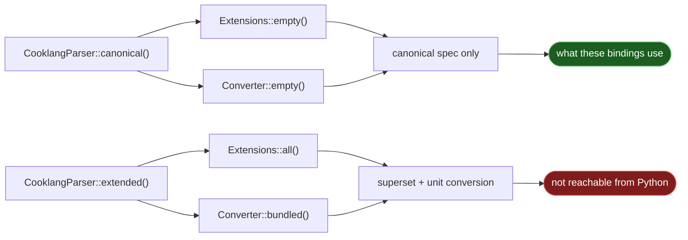

# Syntax extensions

Cooklang has a canonical specification, and `cooklang-rs` parses a **superset**
of it — a set of opt-in [syntax extensions][ext] such as ingredient aliases,
modifiers, and range values.

**These bindings currently parse canonical Cooklang only.** Extensions are off,
and there is no way to turn them on. That is not a decision this package made;
it is a limit of the interface upstream exposes, explained below.

## The two parser modes

`cooklang-rs` builds its parser one of two ways:



Upstream's UniFFI binding hardcodes the first one:

```rust
// bindings/src/lib.rs
pub fn parse_recipe(input: String, scaling_factor: f64) -> Arc<CooklangRecipe> {
    let parser = cooklang::CooklangParser::canonical();
    // ...
}
```

`parse_recipe` takes no parser-mode argument, and no other exported function
offers one. The Swift and Kotlin bindings share this constraint — it is not
Python-specific.

## How to turn extensions off

Nothing to do: they are already off, and cannot be switched on. If you are
migrating from a parser that accepted extended syntax, that is the direction of
the difference — this is the stricter parser, not the looser one.

## What canonical mode costs

The extensions upstream defines:

| Extension | Syntax | In these bindings |
| --- | --- | --- |
| Component modifiers | `@&onion{1}`, `@?onion{1}` | Not parsed |
| Component alias | `@onion\|onions{1}` | Not parsed |
| Advanced units | `@flour{10 kg}` (no `%`) | Not parsed |
| Modes | `>> [mode]: value` | Not parsed |
| Inline quantities | quantities found in prose | Not parsed |
| Range values | `@onion{1-2}` | Not parsed |
| Timer requires time | `~{}` becomes an error | Not enforced |
| Intermediate preparations | `@&(~1)dough{}` | Not parsed |

!!! warning "Extended syntax is misparsed, not rejected"

    This is the part that matters. Cooklang is a forgiving format, so a parser
    that does not understand a piece of syntax does not reject it — it reads it
    as ordinary text. Extended markup therefore ends up **inside your data**:

    ```pycon
    >>> import cooklang
    >>> cooklang.parse("Add @onion|onions{1}.").ingredients[0].name
    'onion|onions'
    >>> cooklang.parse("Add @&onion{1}.").ingredients[0].name
    '&onion'
    >>> cooklang.parse("Add @?onion{1}.").ingredients[0].name
    '?onion'

    ```

    An ingredient named `&onion` is corrupt data, and nothing raises to tell
    you. If you ingest recipes from the wider ecosystem, assume some of them
    use extended syntax.

Quantities degrade the same way — to text rather than to numbers and units:

```pycon
>>> import cooklang
>>> cooklang.parse("Add @flour{10 kg}.").ingredients[0].quantity
Quantity(value='10 kg', unit=None, text='10 kg')
>>> cooklang.parse("Add @onion{1-2}.").ingredients[0].quantity.value
'1-2'

```

Compare the canonical spelling, which parses properly:

```pycon
>>> import cooklang
>>> cooklang.parse("Add @flour{10%kg}.").ingredients[0].quantity
Quantity(value=10, unit='kg', text='10 kg')

```

### No unit conversion either

`canonical()` also pairs with `Converter::empty()`, so the parser carries no
knowledge of units. Quantities in *compatible* units are not converted before
being totalled — they stay as separate entries:

```pycon
>>> import cooklang
>>> recipe = cooklang.parse("Add @water{1%kg} then @water{500%g}.")
>>> totals = cooklang.combine_ingredients(recipe.ingredients)
>>> sorted(q.text for q in totals["water"])
['1', '500']

```

Same-unit amounts still combine correctly — see
[Aisle configuration](guide/aisle.md) — but `1%kg + 500%g` will not become
`1.5%kg`.

## Supporting the superset

It needs a change upstream: an exported parse function that accepts a parser
mode or extension flags, e.g.

```rust
pub fn parse_recipe_with_extensions(
    input: String,
    scaling_factor: f64,
    extensions: u32,
) -> Arc<CooklangRecipe>
```

Everything else is already in place — the model types carry no assumption about
which mode produced them, so only the parser construction has to change.

This project deliberately does not patch the vendored crate: it pins upstream at
a tag and uses it unmodified, so that what these bindings expose is exactly what
upstream supports. See [Relationship to cooklang-rs](upstream.md).

[ext]: https://github.com/cooklang/cooklang-rs/blob/main/extensions.md
