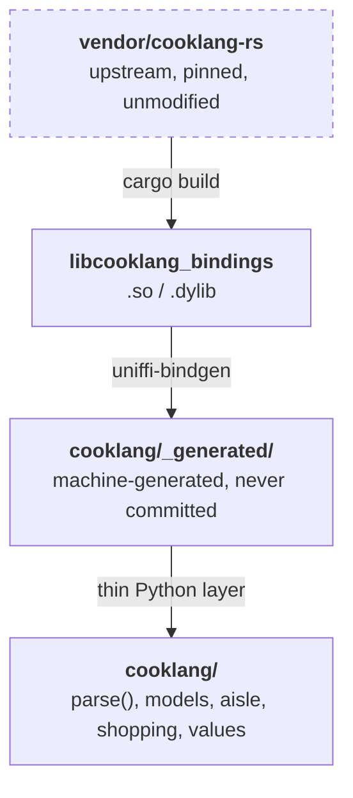

# Relationship to cooklang-rs

**This project is a binding to [cooklang-rs][upstream], not a fork of it.**

That distinction is not cosmetic — it determines what this package contains,
what it is responsible for, and how it is licensed. This page spells it out.

## What that means in practice

This package contains **no Cooklang parser logic**. All parsing is performed by
the upstream Rust crate.

Specifically, the build:

1. Takes upstream's `cooklang-bindings` crate — the `bindings/` directory of
   the cooklang-rs repository — as a **git submodule pinned to tag v0.18.7**,
   used **unmodified**.
2. Compiles it to a cdylib.
3. Runs [UniFFI][uniffi] over the interface that crate already declares, to
   generate a Python module.
4. Adds a thin Pythonic layer (`parse`, the frozen dataclasses, the helpers)
   over that generated output.

Steps 1–3 are mechanical. The interface in step 3 is not one this project
invented: it is **the same interface behind upstream's own Swift and Kotlin
bindings**. This package adds a third target to a list upstream already
maintains.



## The pinned version

```pycon
>>> import cooklang
>>> cooklang.UPSTREAM_VERSION
'0.18.7'

```

The pin is deliberate: for a binding, reproducible builds matter more than
tracking upstream's tip. CI fails if `UPSTREAM_VERSION` and the submodule tag
ever disagree, so the constant cannot drift from what was actually compiled in.

Moving to a new upstream release means bumping the submodule to the new tag,
updating `UPSTREAM_VERSION`, and running the test suite. The suite is written
against *parser behaviour*, not against the binding's plumbing, so a behavioural
regression in the bump shows up as a test failure.

## Licensing

Upstream is MIT. This project is MIT. Distributed wheels contain a compiled
copy of the MIT-licensed upstream code, in the form of the
`libcooklang_bindings` shared library and the Python module UniFFI generates
from it.

Both `LICENSE` and `NOTICE` ship in the wheel (`license-files` in
`pyproject.toml` lists them), so the attribution travels with the binary rather
than living only in the repository. `NOTICE` is where the binding-not-fork
statement is recorded formally, along with the upstream copyright.

The code original to this project — the `cooklang` Python API layer, the build
and generation scripts, and the test suite — is copyright Patrick Forringer and
likewise MIT.

## What this project is responsible for

| | Owned by |
| --- | --- |
| Cooklang syntax and semantics | upstream |
| Parser correctness | upstream |
| The UniFFI interface definition | upstream |
| The generated Python module | UniFFI, from upstream's interface |
| The Pythonic layer and its API stability | this project |
| Wheel building and platform support | this project |
| Working around UniFFI Python-target gaps | this project |

A bug in how `@onion{1-2}` is interpreted belongs upstream. A bug in how this
package turns that into a `Quantity` belongs here.

## Known upstream gaps

Two, both tracked as drafts in `UPSTREAM_ISSUES.md` in the repository root and
neither filed upstream yet. The second is covered in full on
[Syntax extensions](extensions.md).


Two behaviours are worth knowing about, because both are pinned by tests so
that an upstream change surfaces here rather than silently changing your types.

### Records used as map keys are unhashable in Python

UniFFI's Python backend emits records as classes with a generated `__eq__` and
no `__hash__`, which Python turns into `__hash__ = None`. Upstream returns
`HashMap<GroupedQuantityKey, Value>`, so the generated converter tries to use
an unhashable object as a dict key, and `combine_ingredients()` and
`use_common_names()` fail with:

```
TypeError: cannot use 'GroupedQuantityKey' as a dict key
```

This is a **UniFFI Python-target gap, not an upstream bug**: the Rust type
derives `Hash + Eq`, and Swift and Kotlin get structural hashing for free,
which is why only Python trips over it.

The second gap is that the bindings cannot enable Cooklang's [syntax
extensions](extensions.md) at all: `parse_recipe` hardcodes
`CooklangParser::canonical()` and takes no parser-mode argument.

`cooklang/_ffi.py` restores a consistent `__hash__` on the generated class at
import, matching upstream's own derive. It is three lines, it touches no parser
logic, and it is covered by a regression test — so a future UniFFI release that
fixes this upstream will not break this package silently.

The user-visible result is simply that it works:

```pycon
>>> recipe = cooklang.parse("Add @salt{2%tsp} then @salt{3%tsp}.")
>>> cooklang.combine_ingredients(recipe.ingredients)
{'salt': (Quantity(value=5, unit='tsp', text='5'),)}

```

### Ranges are an extension, not canonical

Upstream's `CooklangParser::canonical()` has range extensions off, so
`@onion{1-2}` parses as the text amount `"1-2"`, not a numeric range.

```pycon
>>> cooklang.parse("@onion{1-2}").ingredients[0].quantity
Quantity(value='1-2', unit=None, text='1-2')

```

The [`Range`][cooklang.models.Range] type is kept in the model because the FFI
can express it — and [`parse_value`][cooklang.values.parse_value] does return
one — but a canonical recipe parse never yields it.

```pycon
>>> cooklang.parse_value("1 - 2")
Range(start=1.0, end=2.0)

```

## Coverage of upstream's surface

Every function upstream exports is reached from Python, and a test
(`test_the_coverage_map_matches_upstream`) fails the moment upstream adds or
removes one. The mapping:

| Upstream function | Reached through |
| --- | --- |
| `parse_recipe` | [`cooklang.parse()`][cooklang.parser.parse] |
| `format_amount` | [`Quantity.text`][cooklang.models.Quantity] |
| `format_value` | [`cooklang.format_value()`][cooklang.values.format_value] |
| `parse_value` | [`cooklang.parse_value()`][cooklang.values.parse_value] |
| `metadata_title` | [`Recipe.title`][cooklang.models.Recipe.title] |
| `metadata_description` | [`Recipe.description`][cooklang.models.Recipe.description] |
| `metadata_tags` | [`Recipe.tags`][cooklang.models.Recipe.tags] |
| `metadata_servings` | [`Recipe.servings`][cooklang.models.Recipe.servings] |
| `metadata_author` | [`Recipe.author`][cooklang.models.Recipe] |
| `metadata_source` | [`Recipe.source`][cooklang.models.Recipe] |
| `metadata_time` | [`Recipe.time`][cooklang.models.Recipe] |
| `metadata_get` | [`Recipe.metadata`][cooklang.models.Recipe] |
| `metadata_get_std` | [`Recipe.metadata`][cooklang.models.Recipe] |
| `metadata_custom_keys` | [`Recipe.metadata`][cooklang.models.Recipe] |
| `deref_component` | raw FFI only (the model resolves references eagerly) |
| `deref_ingredient` | raw FFI only ([`Recipe.ingredients`][cooklang.models.Recipe]) |
| `deref_cookware` | raw FFI only ([`Recipe.cookware`][cooklang.models.Recipe]) |
| `deref_timer` | raw FFI only ([`Recipe.timers`][cooklang.models.Recipe]) |
| `combine_ingredients` | [`cooklang.combine_ingredients()`][cooklang.parser.combine_ingredients] |
| `combine_ingredients_selected` | `combine_ingredients(indices=...)` |
| `use_common_names` | `combine_ingredients(aisle=...)` |
| `parse_aisle_config` | [`cooklang.parse_aisle_config()`][cooklang.aisle.parse_aisle_config] |
| `parse_shopping_list` | [`cooklang.parse_shopping_list()`][cooklang.shopping.parse_shopping_list] |
| `write_shopping_list` | [`ShoppingList.to_text()`][cooklang.shopping.ShoppingList.to_text] |
| `parse_shopping_checked` | [`cooklang.parse_checked_log()`][cooklang.shopping.parse_checked_log] |
| `shopping_checked_set` | [`cooklang.checked_names()`][cooklang.shopping.checked_names] |
| `compact_shopping_checked` | [`cooklang.compact_checked_log()`][cooklang.shopping.compact_checked_log] |
| `write_shopping_check_entry` | [`Checked.to_text()`][cooklang.shopping.Checked.to_text] / [`Unchecked.to_text()`][cooklang.shopping.Unchecked.to_text] |

The four `deref_*` functions have no Pythonic wrapper on purpose: the model
resolves component references eagerly at parse time, so it never hands out an
unresolved reference for a caller to dereference. They are still exercised by
the test suite through the generated module.

## Reaching the raw FFI

The generated module is available if you need something the Python layer does
not expose:

```pycon
>>> from cooklang._ffi import ffi
>>> raw = ffi.parse_recipe("Chop @onion{1}.", 1.0)
>>> ffi.deref_ingredient(raw, 0).name
'onion'

```

That is the mechanical UniFFI surface. It is **not** covered by this package's
API stability: it changes when upstream's interface changes.

[upstream]: https://github.com/cooklang/cooklang-rs
[uniffi]: https://mozilla.github.io/uniffi-rs/
